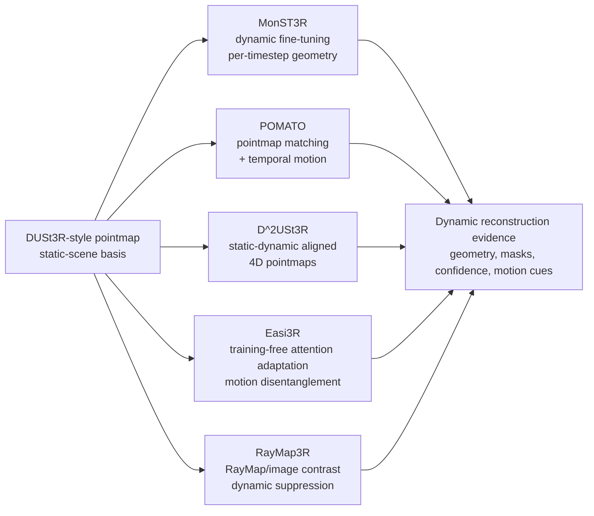
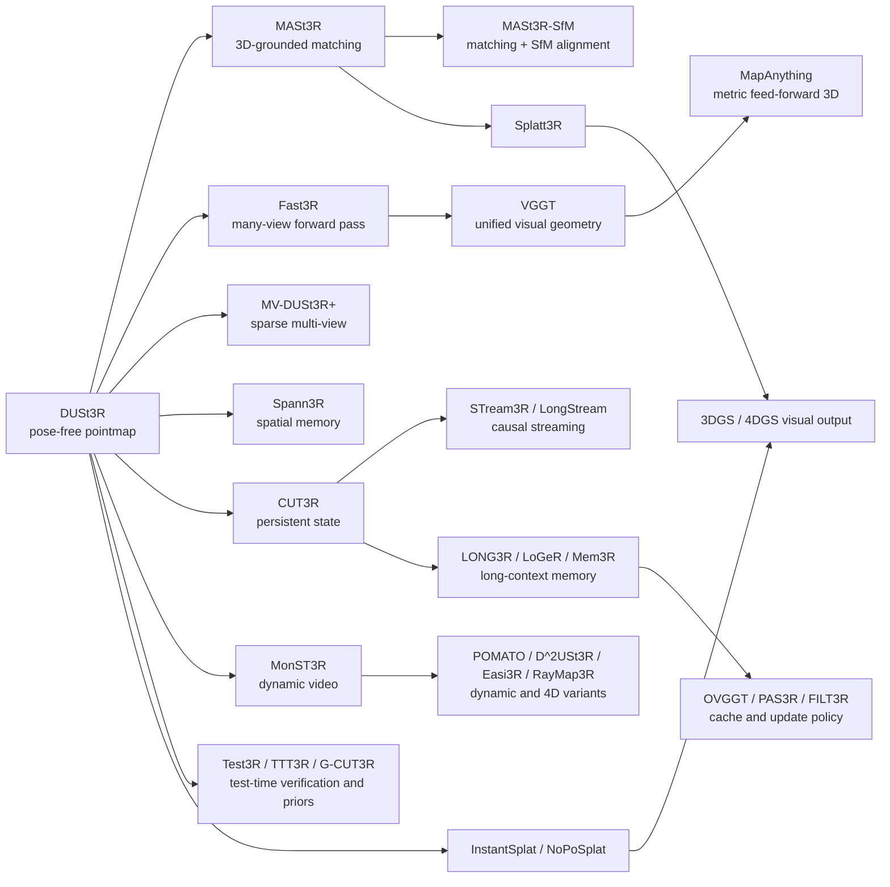
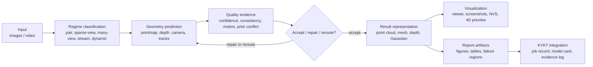

# Figure plan and prompts

Status: figure/table planning document. No AI-generated image has been created yet. Current `main.typ` already contains Typst tables and table-based figures, but the survey still needs clearer route-map style figures before it reads like a mature review article.

Figure policy:

- Prefer Typst-native diagrams or Mermaid-style drafts for taxonomy and pipeline figures.
- Use paper figures only after checking the original paper license/venue policy and keeping attribution clear.
- If a raster AI figure is later generated, record the exact prompt, model/tool, date, and output filename here before using it in the survey.
- Do not use decorative images. Every figure must explain a relation that the text uses.

## Current gap and implementation priorities

The current PDF has enough textual comparison, but its visuals are still too table-like. The next revision should turn the most important relations into explicit diagrams and keep supporting tables for evidence. Priority order:

1. Replace or supplement the lineage table with a true route-map figure: DUSt3R root, branches for matching, many-view, streaming memory, dynamic 4D, test-time mechanisms, and Gaussian output.
2. Add a dynamic 3R mechanism figure/table where Easi3R is visible as a separate training-free attention-adaptation route, not merely a name in a row.
3. Add an evidence matrix table for application claims: output artifact, quality signal, reproducibility evidence, license/dependency status, and whether the claim is paper-level or locally observed.
4. Keep all performance numbers out of figures unless the exact benchmark table has been checked.

Source candidates from local PDFs are tracked in `notes/figure_selection.md`. That file should be consulted before embedding or redrawing any paper-derived figure.

## Planned figure/table inventory

| id | type | title / purpose | status | target location |
|---|---|---|---|---|
| Figure 1 | diagram | 3R model lineage from DUSt3R to major branches | planned; currently approximated by a Typst table | after method comparison or before taxonomy |
| Figure 2 | diagram/table hybrid | capability taxonomy by input/output/temporal/prior axes | planned | method comparison section |
| Figure 3 | flowchart | application path from images/video to usable artifacts and evidence logs | present as table; needs flowchart redraw | application path section |
| Figure 4 | two-column diagram | traditional geometry pipeline vs learned pointmap pipeline | present as table; can be improved | pointmap section |
| Figure 5 | diagram/table hybrid | long-sequence memory primitives | present as table; acceptable but can be redrawn | memory section |
| Figure 6 | diagram | dynamic 3R mechanism map, including Easi3R | new priority | dynamic/4D section |
| Table 1 | table | literature relevance tiers | present | methods section |
| Table 2 | table | supporting priors and their roles | present | priors section |
| Table 3 | table | dynamic 3R mechanism comparison with Easi3R | present after latest revision | dynamic/4D section |
| Table 4 | table | core/many-view/unified models | present | method comparison section |
| Table 5 | table | video/dynamic/long-sequence models | present | method comparison section |
| Table 6 | table | verification/adaptation/Gaussian output | present | method comparison section |
| Table 7 | evidence matrix | application readiness and claim evidence | planned | quality/limitations or appendix |

## Figure 6: Dynamic 3R mechanism map

Purpose: make the dynamic branch readable and prevent Easi3R from being lost inside a list.

Preferred rendering: Typst diagram or Mermaid-rendered draft.



Draft caption:

```text
动态 3R 方法并非同一条技术路线。MonST3R 倾向通过动态数据 fine-tuning 扩展 pointmap，POMATO 引入 pointmap matching 与 temporal motion，D^2USt3R 输出 static-dynamic aligned 4D pointmaps，Easi3R 通过推理时 attention adaptation 做 training-free motion disentanglement，RayMap3R 则利用 RayMap/image contrast 抑制动态区域对 streaming memory 的干扰。
```

Optional AI image prompt:

```text
Create a restrained academic diagram showing five mechanisms for dynamic feed-forward 3D reconstruction after DUSt3R. Use a white background, compact boxes, thin arrows, and muted colors. Center-left root box: "DUSt3R-style pointmap". Five branches: "MonST3R: dynamic fine-tuning", "POMATO: pointmap matching + temporal motion", "D^2USt3R: static-dynamic aligned 4D pointmaps", "Easi3R: training-free attention adaptation", "RayMap3R: RayMap/image contrast dynamic suppression". End with a small evidence box: "geometry, masks, confidence, motion cues". No decorative icons, no 3D rendering, no slogans.
```

## Figure 1: 3R model lineage

Purpose: show how DUSt3R-style pointmap prediction branches into matching, multi-view scaling, streaming memory, dynamic 4D, verification/adaptation, and Gaussian output.

Preferred rendering: Mermaid draft first, then Typst redraw for final PDF.



Draft notes:

- Avoid drawing this as a strict chronological tree; several links are conceptual rather than direct inheritance.
- Use line styles in final Typst version: solid for direct family/inheritance, dashed for representation or application bridge, dotted for support/prior.
- Put Dream nowhere in the model lineage; Dream only appears in the later application/methodology figure if needed.

Optional AI image prompt if a bitmap overview is later needed:

```text
Create a clean academic diagram, not a marketing illustration, showing the genealogy of recent feed-forward 3D reconstruction methods. Use a white background, thin black and muted blue lines, compact rectangular labels, and six grouped branches: pointmap matching, multi-view scaling, streaming memory, dynamic 4D, test-time verification, and Gaussian output. Include DUSt3R as the root and branch labels for MASt3R, MASt3R-SfM, Fast3R, MV-DUSt3R+, VGGT, MapAnything, CUT3R, Spann3R, Point3R, STream3R, LONG3R, LoGeR, Mem3R, OVGGT, MonST3R, POMATO, D^2USt3R, Easi3R, RayMap3R, Test3R, TTT3R, G-CUT3R, Splatt3R, InstantSplat, NoPoSplat, 3DGS, and 4DGS. No 3D icons, no glowing effects, no slogans.
```

## Figure 2: Capability taxonomy

Purpose: organize methods by capability rather than by paper date.

Preferred rendering: Typst matrix/table, possibly with color-light bands.

Rows:

1. input regime: pair, sparse-view, many-view, video, long stream, dynamic video
2. output representation: pointmap, depth, camera, tracks, memory/cache, Gaussian
3. camera requirement: pose-free, optional pose/prior, calibrated/posed
4. temporal handling: none, short video, recurrent state, long-context cache, dynamic suppression
5. verification/adaptation: none, SfM consistency, test-time consistency score, test-time update, guided prior
6. application readiness: paper only, code listed, checkpoints/demo listed, locally observed, license-sensitive

Initial grouping:

| Capability | Representative methods |
|---|---|
| pointmap foundation | DUSt3R, MASt3R |
| matching and SfM bridge | MASt3R, MASt3R-SfM |
| many-view / unified geometry | Fast3R, MV-DUSt3R+, VGGT, MapAnything |
| priors and depth alignment | Align3R, Pow3R, Depth Anything V2, Depth Pro, Metric3D v2 |
| streaming state | CUT3R, STream3R, LongStream |
| explicit memory/cache | Spann3R, Point3R, LONG3R, LoGeR, Mem3R, OVGGT |
| adaptive update/filtering | PAS3R, FILT3R, TTT3R |
| dynamic / 4D pointmaps | MonST3R, POMATO, D^2USt3R, Easi3R, RayMap3R |
| test-time checking and guidance | Test3R, G-CUT3R, MASt3R-SfM |
| renderable output | Splatt3R, InstantSplat, NoPoSplat, 3DGS, 4DGS |

Optional AI image prompt:

```text
Design a restrained academic capability taxonomy chart for feed-forward 3D reconstruction. Use a grid with rows for input regime, output representation, camera/prior requirement, temporal handling, verification/adaptation, and application readiness. Place model names as small labels in the cells. Use neutral gray, teal, and muted amber only. The figure should look like a journal survey diagram, with no decorative backgrounds, no icons except simple arrows/check marks, and no promotional language.
```

## Figure 3: Application path from images to usable artifacts

Purpose: explain how model outputs become inspectable or reportable results, with quality checks separated from reconstruction.

Preferred rendering: Mermaid/Typst flowchart.



Draft notes:

- The quality-evidence block must not claim automatic correctness; it only records signals.
- The KYKT block should be a small terminal node, not the center of the figure.
- The figure should make clear that a runnable pipeline is not a quality claim.

Optional AI image prompt:

```text
Create a clear pipeline diagram for an academic Chinese survey. The pipeline starts with images or video, then branches to regime classification, geometry prediction, quality evidence, accept/repair/reroute decision, output representation, visualization, report artifacts, and KYKT-style evidence logging. Use simple flat boxes and arrows, white background, muted professional colors, and compact text. Do not add mascots, glowing effects, slogans, or oversized icons.
```

## Figure 4: Traditional pipeline vs learned pointmap pipeline

Purpose: help readers see why DUSt3R-style models changed the problem setup.

Preferred rendering: two-column Typst diagram.

Left column:

```text
feature extraction -> matching -> pose estimation -> triangulation -> MVS/depth fusion -> point cloud/mesh
```

Right column:

```text
image pair/set -> transformer encoder/decoder -> pointmap + confidence -> alignment / matching / pose / depth / output
```

Caption idea:

```text
传统流程把匹配、位姿、三角化和融合分为多个显式阶段；pointmap 路线则把部分中间变量收进可学习的稠密 3D 表示，再按任务导出深度、匹配、位姿或可视化结果。
```

## Figure 5: Memory primitives in long-sequence 3R

Purpose: prevent conflating CUT3R, Point3R, Mem3R, OVGGT and related methods.

Preferred rendering: Typst table/diagram with four boxes.

Boxes:

- recurrent latent state: CUT3R, STream3R
- spatial memory / pointer store: Spann3R, Point3R
- hybrid local/global or tracking/mapping memory: LONG3R, LoGeR, Mem3R
- cache governance and update rules: OVGGT, PAS3R, FILT3R, LongStream

Caption boundary:

```text
这些方法都处理长序列问题，但“状态”“空间记忆”“KV/cache”“更新增益”不是同一个机制；正文比较时需要按存储对象和更新规则拆开。
```

## Figure sourcing checklist

- [ ] Decide whether Figure 1 and Figure 3 use final Typst drawing or Mermaid-rendered raster.
- [ ] Check whether DUSt3R/MASt3R/VGGT paper figures can be reused under venue policy; if not, redraw abstractly.
- [ ] Add generated/derived assets to `figures/` with source note.
- [ ] Keep all AI prompts in this file before using generated images.
- [ ] Check captions for unsupported performance or deployment claims.
